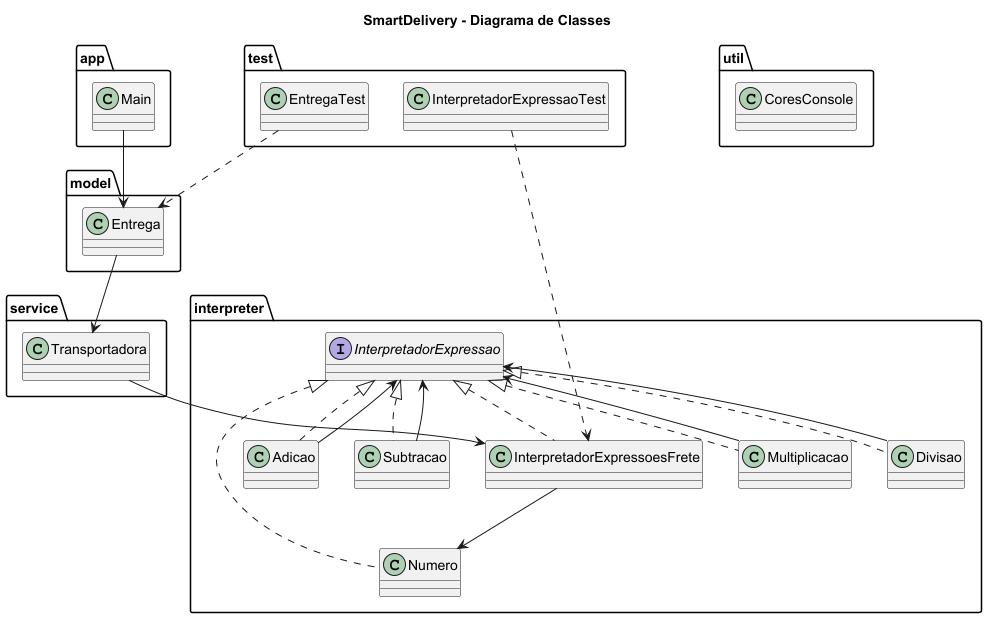

# SmartDelivery

Sistema desenvolvido em Java utilizando o padrão de projeto **Interpreter** para realizar o cálculo de fretes a partir de fórmulas configuráveis.

O projeto simula uma transportadora que calcula automaticamente o valor do frete de uma entrega com base em uma expressão matemática definida em uma fórmula textual. Essa expressão é interpretada em tempo de execução utilizando o padrão Interpreter, permitindo que a regra de cálculo seja alterada sem modificar a lógica principal da aplicação.

---

# Padrão de Projeto Utilizado

## Interpreter

O padrão comportamental **Interpreter** define uma representação para uma linguagem e um interpretador capaz de avaliar expressões dessa linguagem.

Neste projeto, o Interpreter é utilizado para interpretar fórmulas de cálculo de frete compostas por operações matemáticas básicas.

### Estrutura do padrão no projeto

| Papel                 | Classe                       |
| --------------------- | ---------------------------- |
| AbstractExpression    | InterpretadorExpressao       |
| TerminalExpression    | Numero                       |
| NonTerminalExpression | Adicao                       |
| NonTerminalExpression | Subtracao                    |
| NonTerminalExpression | Multiplicacao                |
| NonTerminalExpression | Divisao                      |
| Context               | Transportadora               |
| Client                | Entrega                      |
| Interpreter           | InterpretadorExpressoesFrete |

---

# Diagrama de Classes



---

# Funcionalidades

* Cadastro de distância da entrega
* Cadastro do peso da carga
* Cálculo automático de frete
* Fórmula configurável para cálculo
* Interpretação dinâmica de expressões matemáticas
* Operações de adição, subtração, multiplicação e divisão

---

# Estrutura do Projeto

```text
padrao-interpreter/
│
├── src/
│   ├── main/
│   │   ├── app/
│   │   │   └── Main.java
│   │   │
│   │   ├── interpreter/
│   │   │   ├── InterpretadorExpressao.java
│   │   │   ├── InterpretadorExpressoesFrete.java
│   │   │   ├── Numero.java
│   │   │   ├── Adicao.java
│   │   │   ├── Subtracao.java
│   │   │   ├── Multiplicacao.java
│   │   │   └── Divisao.java
│   │   │
│   │   ├── model/
│   │   │   └── Entrega.java
│   │   │
│   │   ├── service/
│   │   │   └── Transportadora.java
│   │   │
│   │   └── util/
│   │       └── CoresConsole.java
│   │
│   └── test/
│       ├── EntregaTest.java
│       └── InterpretadorExpressaoTest.java
│
├── docs/
│   ├── diagrama-classe.puml
│   └── diagrama-classe.png
│
├── README.md
│
└── .gitignore
```

---

# Fórmula de Frete

A fórmula utilizada pela transportadora pode ser alterada facilmente:

```java
public static String formulaFrete =
        "distancia * 2 + peso";
```

Exemplo:

Para uma entrega com:

* Distância: 10 km
* Peso: 5 kg

O cálculo realizado será:

```text
10 * 2 + 5
=
25
```

Resultado:

```text
Frete = R$ 25,00
```

---

# Tecnologias Utilizadas

* Java 17
* IntelliJ IDEA
* JUnit 5
* PlantUML
* Git

---

# Execução da Aplicação

Execute a classe:

```text
src/main/app/Main.java
```

---

# Execução dos Testes

Execute os testes localizados em:

```text
src/test
```

Pela IntelliJ IDEA:

* Clique com o botão direito na pasta `test`
* Run Tests

Ou utilizando Maven:

```bash
mvn test
```

---

# Casos de Teste Implementados

## EntregaTest

* Deve calcular frete da entrega 1
* Deve calcular frete da entrega 2
* Deve retornar distância corretamente
* Deve retornar peso corretamente

## InterpretadorExpressaoTest

* Deve interpretar adição
* Deve interpretar subtração
* Deve interpretar multiplicação
* Deve interpretar divisão
* Deve interpretar expressão completa

---

# Exemplo de Saída

```text
=== SMART DELIVERY ===

Frete da entrega 1: R$ 25.0

Frete da entrega 2: R$ 48.0
```

---
